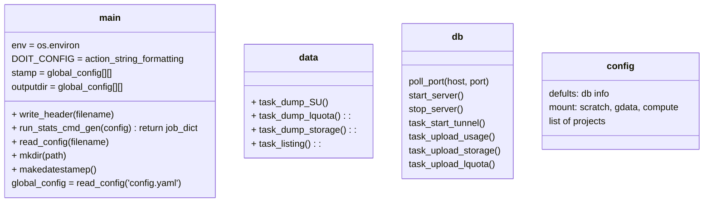

```mermaid
classDiagram
    class main {
        + write_header(filename)
        + run_stats_cmd_gen(config) return job_dict
        + read_config(filename)
        + mkdir(path)
        + makedatestamep()

        env = os.environ
        DOIT_CONFIG = action_string_formatting
        global_config = read_config('config.yaml')
        stamp = global_config[][]
        outputdir = global_config[][]
    }

    class data {
        + task_dump_SU()
        + task_dump_lquota():
        + task_dump_storage():
        + task_listing():

    }

    class db{
        poll_port(host, port)
        start_server()
        stop_server()
        task_start_tunnel()
        task_upload_usage()
        task_upload_storage()
        task_upload_lquota()
    }

    class config{
        defults: db info
        mount: scratch, gdata, compute 
                list of projects
    }
```